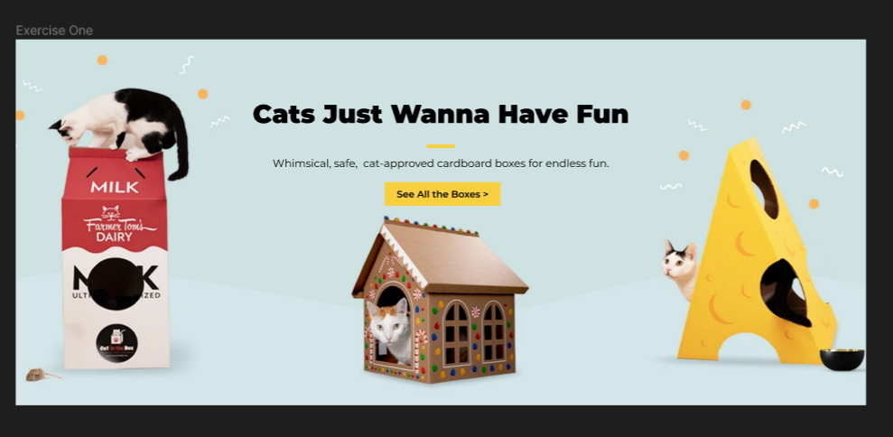
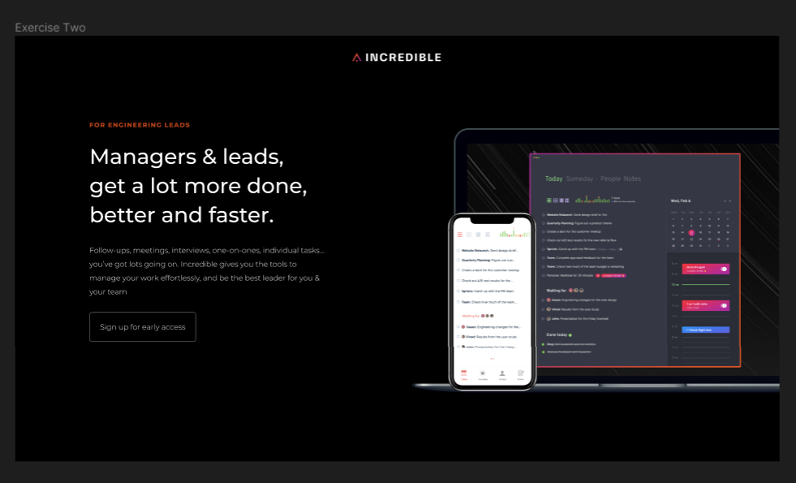
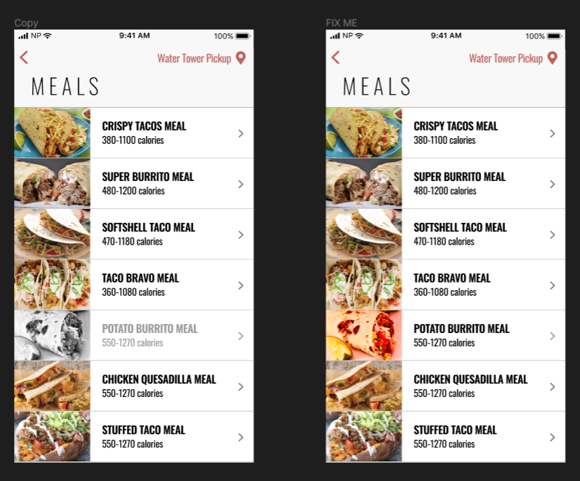

## Hello there, my fellow Alfbuddy! 💖

You've made it—great job! Now, here's the scoop: this markdown file is your **canvas**. Customize it; let your creativity flow!

Remember, you're free to add your personal touch, but keep the sacred requirements intact; they are the guardians of order here. This markdown file should or may include:

-   Link to your own file of **"Week 1 [Day 4] : Activity"**
Figma Link: https://www.figma.com/file/Z3DUkK4Z3rImjC9oEPdpay/Week-1-(day-4)-%3A-Design-Components-Dvd-(Community)?type=design&node-id=4%3A167&mode=design&t=pU7FU8GUoOcnGGYf-1
-   A screenshot of your final activity output _(optional)_
 
 
 

Ready to include your output for **Day 4**? Let the customization begin! 🚀✨

<!-- You may now delete and modify the content of this file -->
